# LARKeyboard
Кастомная механическая клавиатура с открытым исходным кодом и интегрированным трекболом.

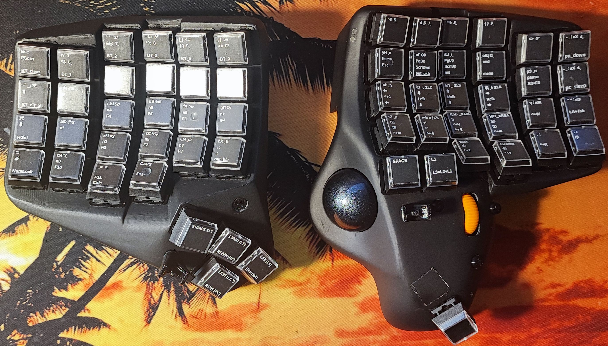 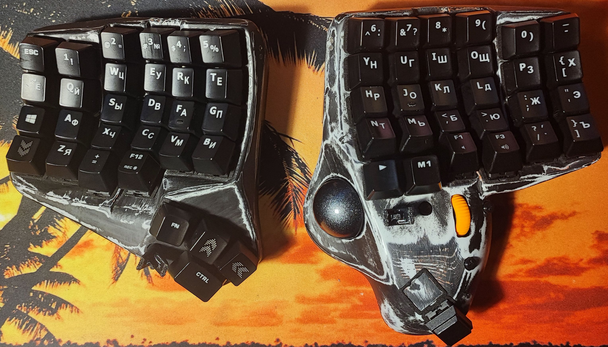 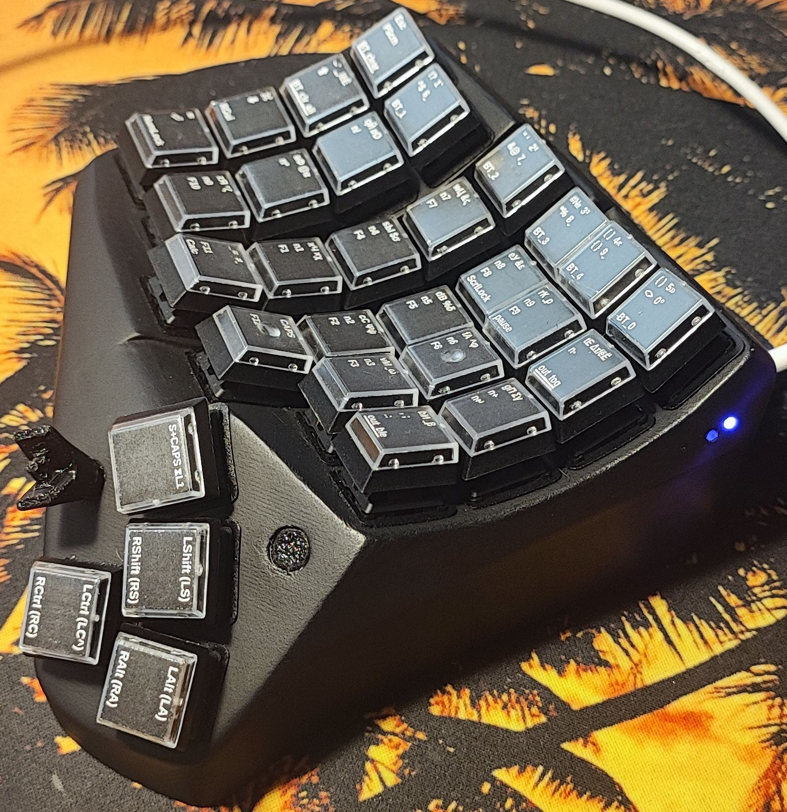 

## **Характеристики**  
- **Прошивка:** ZMK 
- **Макет:** Split Dactyl Manuform
- **Микроконтроллер:** (NRF52840 Development Board )  
- **Кейкапы:** ( MX )  
- **Интерфейс:** (USB-C, Bluetooth)  
- **Особенности:** (интегрированный трекболл ProtoArc EM04 Wireless, функционирующий независимо от клавиатуры),  

## 🔗 Быстрые ссылки

- 📁 [Репозиторий с прошивкой](https://github.com/katafoxi/zmk-keyboard-lark)

- 📊 [Легенды клавиш и кеймап](https://docs.google.com/spreadsheets/d/1xXg7V_umpOhjsuPLZJ3ickMg2kA1LSvM3Gqmz-Sg8EQ/edit)

## 🛠️ Hardware

📦 Bill of Materials (BOM) (кликните, чтобы развернуть)

| Этап сборки                           | Компонент                                                        | Количество |
| ------------------------------------- | :--------------------------------------------------------------- | ---------: |
| 3D-печать                             | Филамент для 3D-печати                                           |     700 гр |
| Печать деталей левой половины         | [_left_print.stp](hardware\3d_models_to_print\_left_print.stp)   |       1 шт |
| Печать деталей правой половины        | [_right_print.stp](hardware\3d_models_to_print\_right_print.stp) |       1 шт |
| Удаление поддержек                    |                                                                  |            |
| Установка заглушек                    | Заглушка в гнездо под покраску                                   |      60 шт |
| Ошкуривание                           |                                                                  |            |
| Покраска                              | Грунтовка + Эмаль                                                | 1+1 баллон |
| Удаление  заглушек                    |                                                                  |            |
| Установка вплавляемых втулок          | Втулка вплавляемая М3х5                                          |      24 шт |
| Установка Hotswap коннекторов         | Коннектор Hotswap MX                                             |      59 шт |
| Пайка столбцов                        | Проволока красная медная эмалированная  QA-1/155R 2UEW ø0.2мм    |      500 м |
| Пайка рядов из диодов                 | Диод  1N4148                                                     |      59 шт |
| Пайка и установка nice!nano_v2        | Плата NRF52840                                                   |       2 шт |
| Обжим проводов для батарейного отсека | Отсек батарейный UM-3x2                                          |       2 шт |
| Установка аккумуляторов               | Аккумулятор 14500 АА Ni-Mh                                       |       4 шт |
| Установка движкового переключателя    | Переключатель движковый L-KLS7-SS03-12D02-EG03                   |       2 шт |
| Установка тактильной кнопки           | Кнопка тактильная SWT-20-5                                       |       3 шт |
| Установка 5-позиционной кнопки        | Кнопка DIP 5 Five way Switch Multi-direction                     |       2 шт |
| Установка наклеек под свитчи          | Наклейки шумоизолирующие                                         |      59 шт |
| Установка свитчей                     | Свитч Cherry MX                                                  |      59 шт |
| Установка трекбола                    | Трекбол ProtoArc EM04 Wireless                                   |       1 шт |
| Установка O-rings                     | Keyboard o-rings 8x5x1.5mm                                       |      59 шт |
| Установка кейкапов                    | Кейкапы                                                          |      59 шт |
| Установка крышек                      | Винт с потайной головкой М3х6                                    |      24 шт |
| Установка держателя L-ключа           | Ключ 2-1-Х9 ГОСТ Р 57981-2017                                    |       1 шт |
| Установка магнитов для L-ключа        | Магнитик неодимовый                                              |       2 шт |
| Сборка и пайка донгла                 |                                                                  |       1 шт |

 

 🔧 Необходимые инструменты 

- ✏️ Пинцет
- ✂️ Кусачки
- 🔪 Скальпель
- 🔌 Паяльник + Флюс
- 📏 Пилочка для ногтей
- 🔥 Зажигалка
- 🔧 Набор ключей шестигранных
- Наждачная сетка P180, P240, P600, P1000
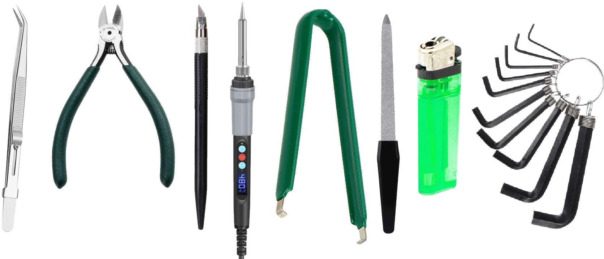

 

**💡 Примечание:** На корпусах заглушены некоторые отверстия под покраску и аккуратное срезание после покраски.

 
📐 Модели для печати

`hardware/_left_print.stp` 
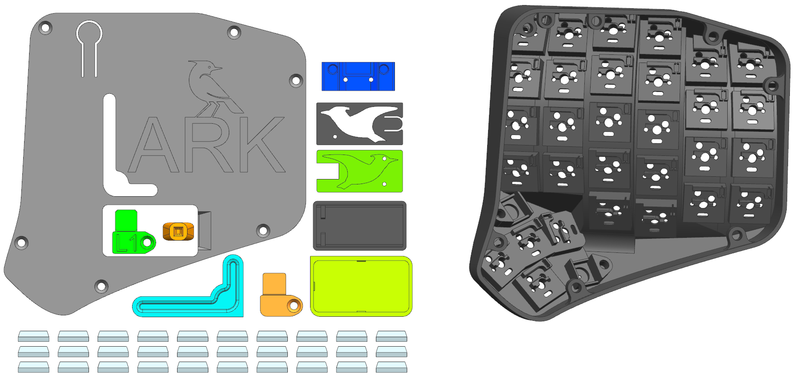

`hardware/_right_print.stp` 
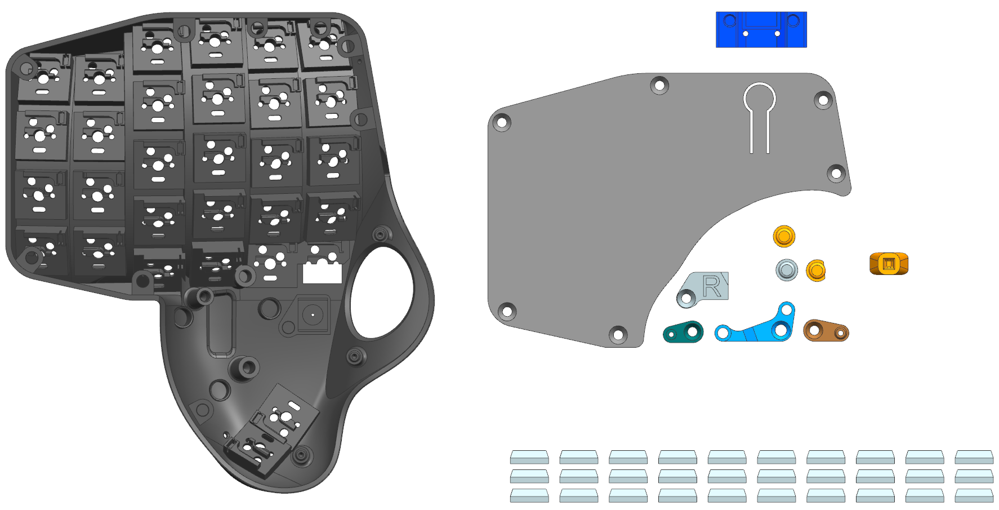

Исходная сборка 

`hardware/_LARKeyboard_full_assambly.stp`
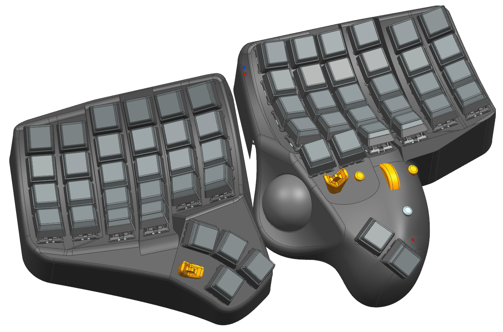

🎥 Видео последовательности сборки левой половинки

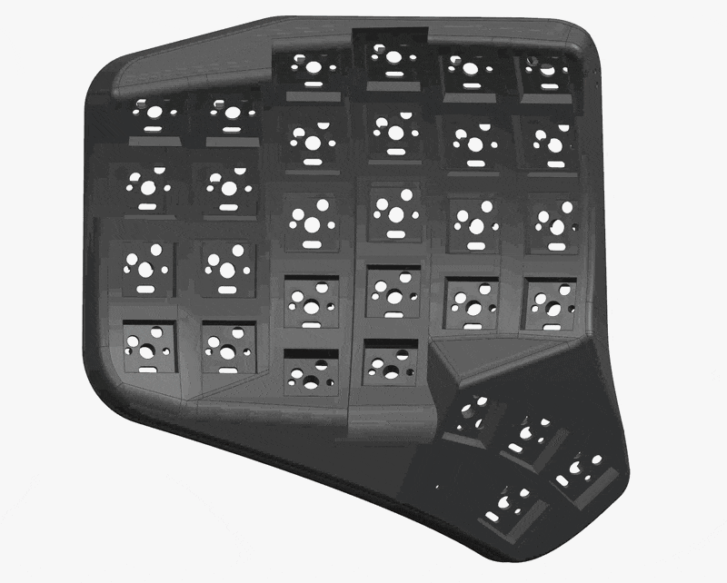

🎥Видео последовательности сборки правой половинки

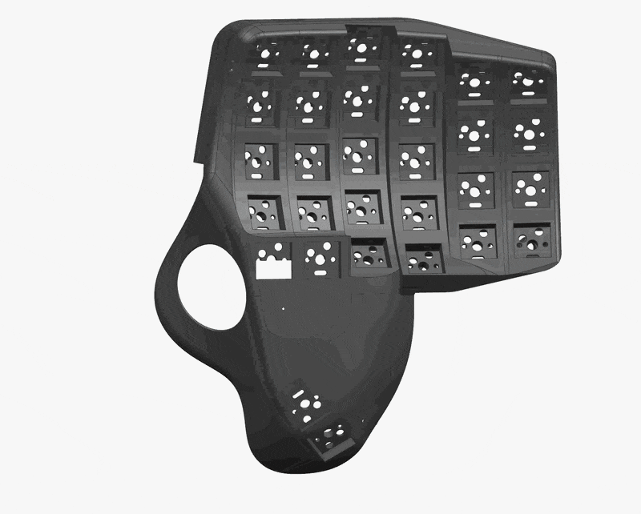

## 📸 Фото последовательности сборки

🔄 Этап 1: Подготовка корпуса

**Процесс:**
- Печать
- Удаление поддержек
- Установка заглушек
- Ошкуривание

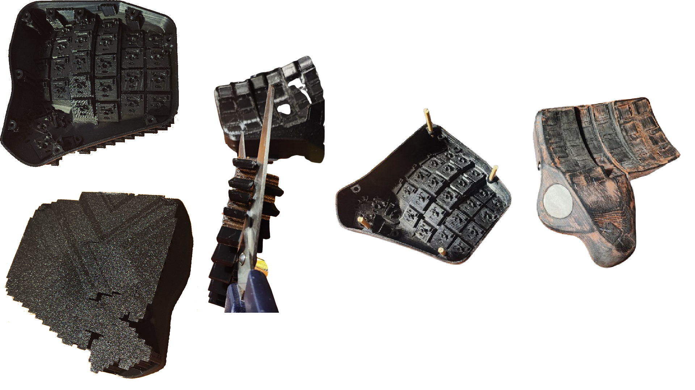

🎨 Этап 2: Покраска

**Процесс покраски:**
1. Грунтовка + Эмаль
2. Ошкуривание P800-P1000
3. Покраска (Эмаль)
4. Удаление заглушек

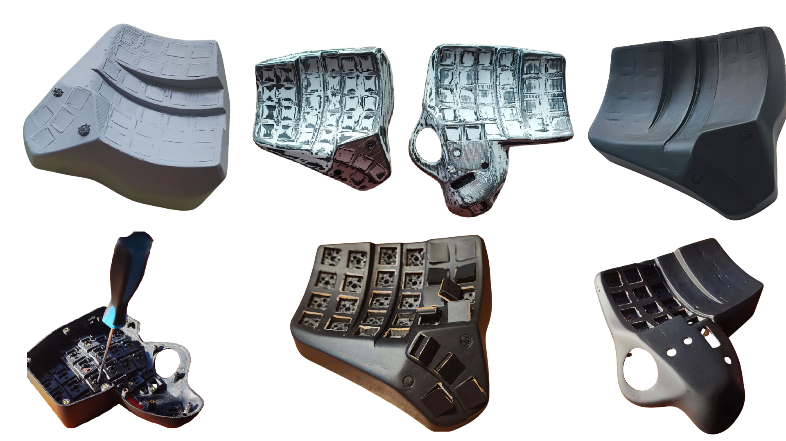

🔌 Этап 3: Электроника

**Процесс:**
- Установка hotswap
- Установка вплавляемых втулок
- Пайка столбцов
- Пайка строк
- Пайка платы NRF52840
- Пайка 5-позиционного переключателя

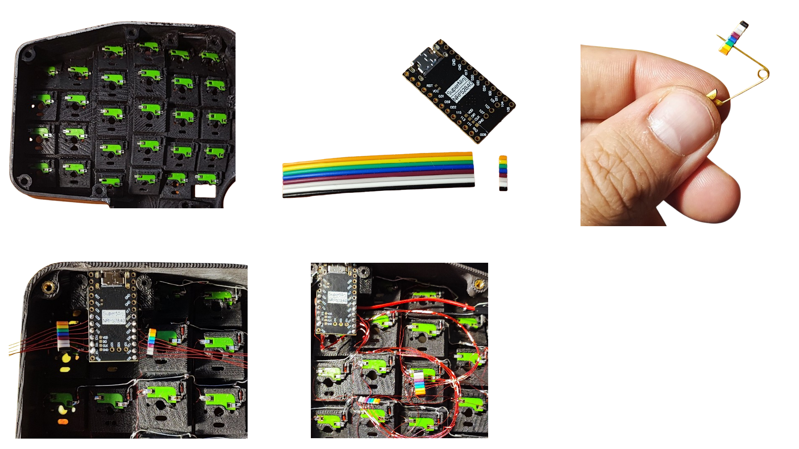

### 📊 Схемы подключения

**Схема левой половинки** 
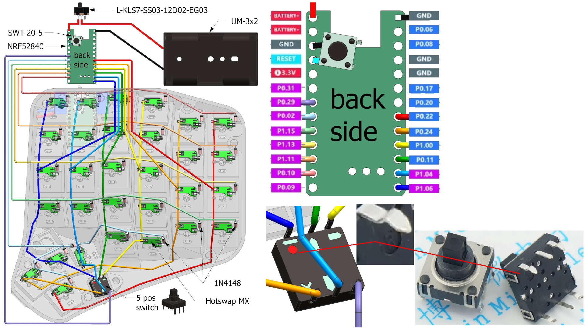

**Схема правой половинки**
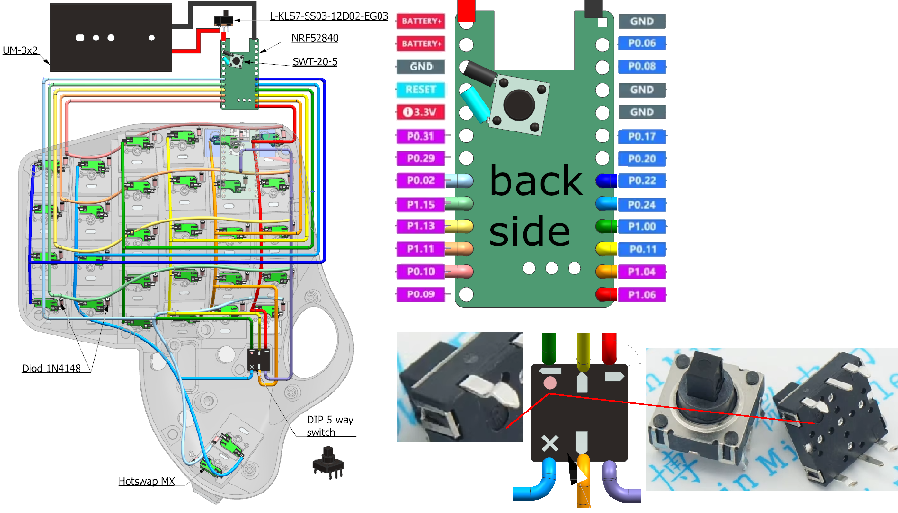

💡 Этап 4: Световоды и трекбол

**💡 Совет по световодам:**
В качестве световода можно использовать прозрачный PLA/PETG ø1.75мм или оптоволокно. 
Отрезаем 2 кусочка длиной 10 см, изгибаем под 90°, вставляем в отверстия в корпусе, 
потом вставляем в держатель платы, наживляем крепеж, обрезаем лишнее, шлифуем торцы пилочкой для ногтей.

**Процесс:**
- Установка светопроводов
- Установка Платы NRF52840
- Подрезка детали платы трекбола
- Установка платы трекбола
- Установка трекбола

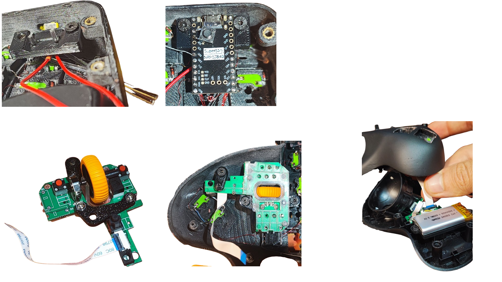

**⚠️ Важно:** Отверстие под шар специально сделано меньше. Острым ножом срезая пластик, 
добейтесь геометрии, при которой шар не выпадает, но легко извлекается для очистки.

🔋 Этап 5: Финальная сборка

**Процесс:**
- Обжим держателя батареек (мама)
- Установка держателя батареек (суперклей)
- Сборка крышек
- Сборка донгла
- Установка шумоизолирующих наклеек

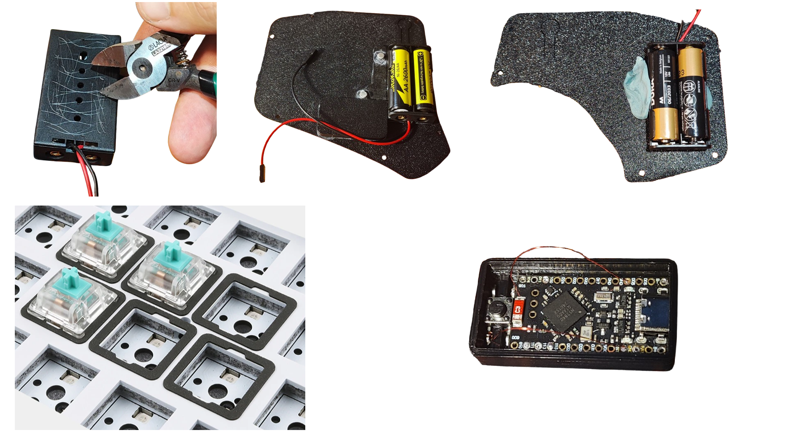

**💡 Инструкция:** Обжать провода выводы B+ и В- от платы (папа), 
соединить с выводами от держателя батареек. Установить крышки.

⌨️ Этап 6: Установка свитчей и кейкапов

При использовании сборных колпачков с прозрачной крышкой:
1. Распечатать [легенды](https://docs.google.com/spreadsheets/d/1xXg7V_umpOhjsuPLZJ3ickMg2kA1LSvM3Gqmz-Sg8EQ/edit)
2. Нарезать легенды
3. Собрать колпачки

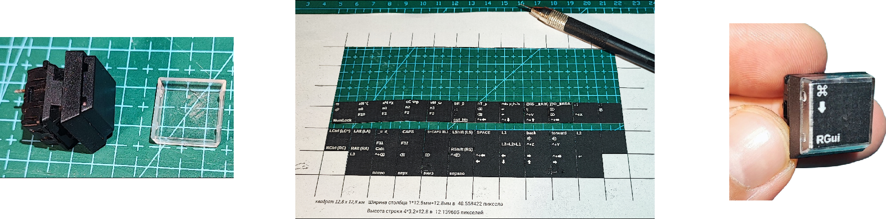

---

## 📚 Дополнительная информация

### 🔗 Полезные ссылки
- [📁 Репозиторий с прошивкой](https://github.com/katafoxi/zmk-keyboard-lark)
- [📊 Google Sheets с легендами](https://docs.google.com/spreadsheets/d/1xXg7V_umpOhjsuPLZJ3ickMg2kA1LSvM3Gqmz-Sg8EQ/edit)

---

## Firmware
[Процесс](https://zmk.dev/docs/user-setup#installing-the-firmware) прошивки сдандартный для ZMK.
[Репозиторий с прошивкой клавиатуры](https://github.com/katafoxi/zmk-keyboard-lark)

**🎉 Поздравляем с завершением сборки LARKeyboard!**  
Наслаждайтесь использованием вашей кастомной клавиатуры с трекболом!

